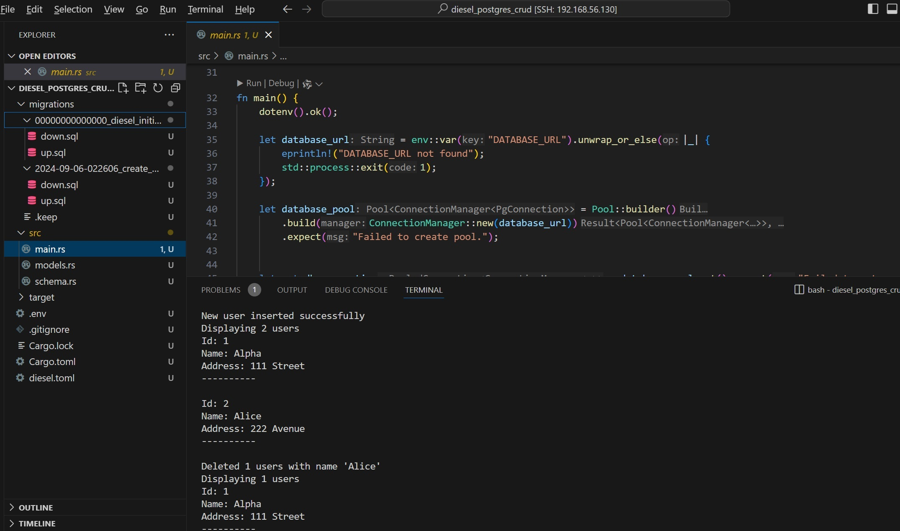

```
# Installing Diesel CLI on Linux
curl --proto '=https' --tlsv1.2 -LsSf https://github.com/diesel-rs/diesel/releases/latest/download/diesel_cli-installer.sh | sh

# Installing Diesel CLI on Windows
powershell -c "irm https://github.com/diesel-rs/diesel/releases/latest/download/diesel_cli-installer.ps1 | iex"

```

Tested on Diesel 2.2, Rust 1.81.0, and Ubuntu 22.04.

```
cargo new diesel_postgres_crud
cd diesel_postgres_crud
# Write DATABASE_URL in file '.env '
diesel setup
diesel migration generate create_users
# Write code in 'up.sql' and 'down.sql' ;
diesel migration run  # When the `users` table is removed and the SQL is run again, the `__diesel_schema_migrations` table may also need to be manually removed first.
# Write code in 'src/models.rs'
# Write code in ' src/main.rs'
sudo apt install libpq-dev  # On Ubuntu 22.04, if an error like "cannot find -lpq: No such file or directory" occurs, use this command to fix it.;
cargo run;
```


Screenshot 


